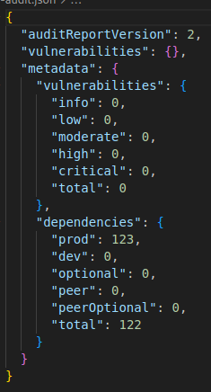
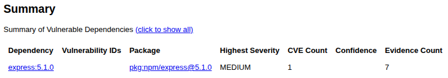

# Лабораторная №1 по дисциплине "Информационная безопасность"

## Разработка защищенного REST API с интеграцией в CI/CD

### Описание проекта и API

Проект создан с использованием фреймворка
Express и реализует 3 эндпоинта:

- POST /auth/register
  Принимает запрос с полями username и password
  Возвращает 400 и описание ошибки при некорректном формате запроса или отсутствующих значениях
  Возвращает 401 и описание ошибки если пользователь уже существует (имя - уникальное поле)
  При успешной регистрации возвращает {success: true}

- POST /auth/login
  Принимает запрос с полями username и password
  Возвращает 400 и описание ошибки при некорректном формате запроса или отсутствующих значениях
  Возвращает 401 и описание ошибки если пользователя не существует (проверка по имени)
  При успешной авторизации возвращает JWT-токен (ключ token)

- GET /api/data
  Возвращает 401 при отсутствии токна в заголовке Authorization
  Возвращает 403 при некорректном JWT-токене в заголовке Authorization
  При успешной проверке авторизации возращает все посты (posts) и имя текущего пользователя (requestedBy)

### Реализованные методы защиты

#### SQL инъекции

Для защиты от SQL инъекции в проекте используется Prisma ORM, позволяющая удобное управление уровнем данных и предотвращающая угрозы инъекций за счет внутренней параметризации.

`await db.user.create({
data: { username: username, password: hashedPassword },
});`

#### XSS

Для защиты от XSS атаки я добавил экранирование возвращаемых пользовательских данных в методе /api/data, с использованием библиотеки validator и метода escape(), сантизирующего опасные символы вроде < > “ ‘.

`res.json({
posts: posts,
requestedBy: validator.escape(req.username),
});`

#### Broken Auth

Для защиты метода /api/posts я реализовал middleware, проверяющую наличие JWT-токена в заголовке Authorization и корректность токена с учетом секрета (который хранится как переменная окружения)

`export const auth = (req, res, next) => {
const authHeader = req.headers["authorization"];
const token = authHeader?.split(" ")[1];
if (token == null) return res.sendStatus(401);

jwt.verify(token, process.env.JWT_SECRET, (err, data) => {
if (err) {
console.log(err);
return res.sendStatus(403);
}
req.username = data.username;
next();
});
};`

При регистрации пароли хешируются, а при авторизации сравниваются с помощью библиотеки bcrypt.

`const salt = await bcrypt.genSalt();
const hashedPassword = await bcrypt.hash(password, salt);`

`const isPasswordCorrect = await bcrypt.compare(password, user.password);`

При успешной авторизации выдается JWT-токен, действующий в течение пяти минут

`const token = jwt.sign({ username }, process.env.JWT_SECRET, {
expiresIn: "5min",
});`

### Отчеты SAST/SCA

#### npm audit

#### OWASP Dep Check

